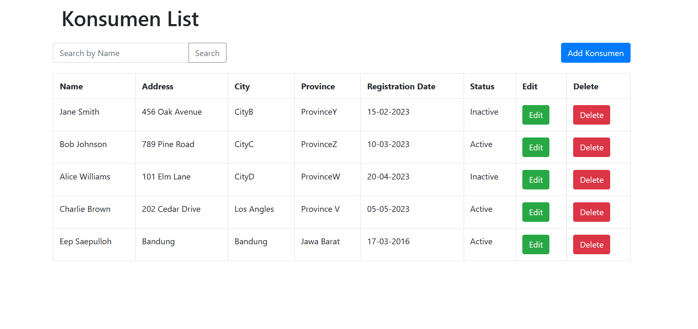

# Simple Web MiniApps (SALT Test)

## Setup Project

- Clone This Repository
- Create New DB in PostgreSQL with the name "JSPWithPostgresql"
- Import the sql file to the DB
- Run the Spring project
- The application will run on [Port:8080](http://localhost:8080/)

## User Guide

After you open the application you will see the application display like the image above.

You can try several features such as:

* Display list konsumen 
* Add Konsumen
* Search Konsumen by name
* Update Konsumen
* Delete konsumen

the data will also be displayed in table form using datatable and bootstrap.
